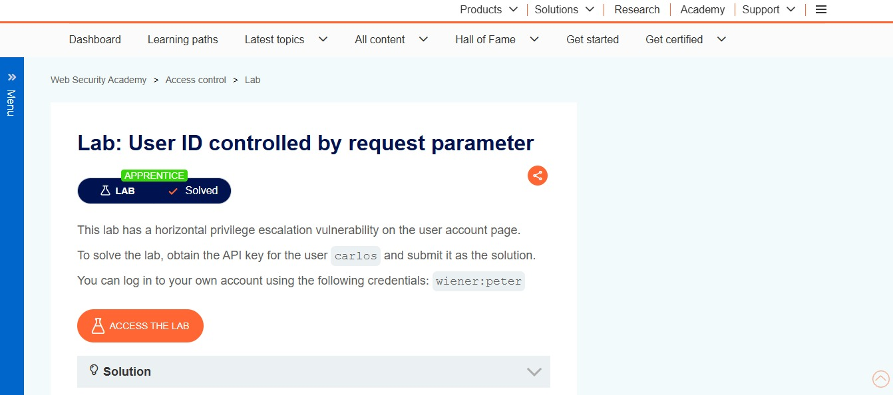
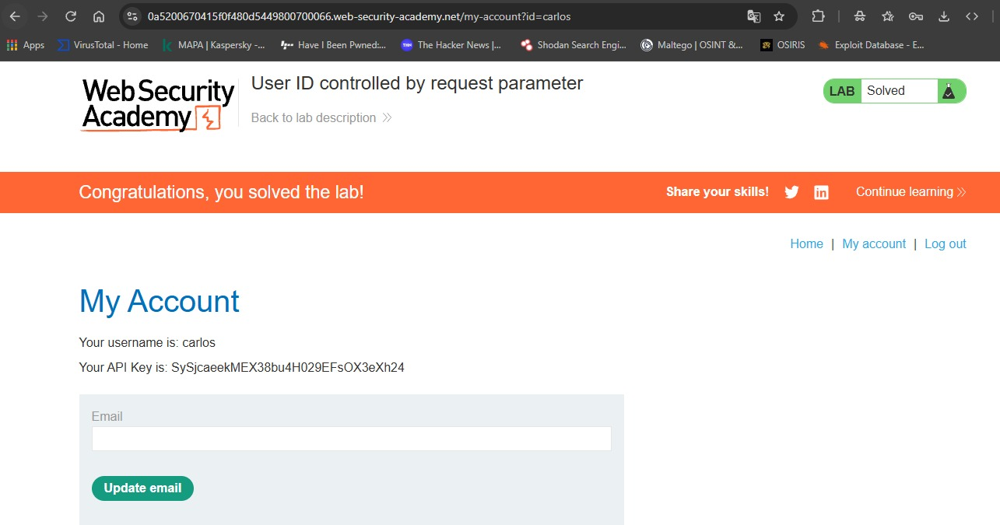

# User ID controlled by request parameter

**Categoría:** Broken Access Control (OWASP A01)
**Tipo:** IDOR (Insecure Direct Object Reference)
**Nivel:** Apprentice (principiante)
**Plataforma:** PortSwigger Web Security Academy

## Descripción

La aplicación expone el identificador de usuario en un parámetro de la URL y lo usa para mostrar los datos de la cuenta, sin verificar que el usuario autenticado tenga permiso para acceder a esa cuenta. El objetivo era obtener la API key de otro usuario (carlos).

## Pasos para reproducir

1. Iniciar sesión con las credenciales provistas por el lab (`wiener:peter`).
2. Ir a la página de la cuenta ("My account").
3. Observar que la URL incluye el parámetro `id=wiener`.
4. Cambiar ese parámetro por `id=carlos` en la URL.
5. La aplicación devuelve la página de la cuenta de carlos, incluida su API key.

## Causa raíz

El servidor confía en el `id` que envía el cliente y devuelve los datos correspondientes sin comprobar que ese `id` pertenezca al usuario de la sesión. Falta un control de acceso del lado del servidor.

## Remediación

Validar la autorización en el servidor, en cada petición: comparar el `id` solicitado contra el usuario autenticado en la sesión y denegar el acceso si no coinciden.

    if (id_solicitado != id_del_usuario_en_sesion) {
        denegar (403 Forbidden)
    }

Ocultar, cifrar o reemplazar el identificador por un valor no adivinable NO resuelve el problema (seguridad por oscuridad): el identificador puede filtrarse o viajar en otras partes de la petición. El control de acceso debe hacerse siempre en el servidor.

## Impacto

Un atacante puede acceder a los datos de cualquier otro usuario con solo modificar el identificador (escalada horizontal). En este lab el acceso fue entre cuentas del mismo nivel. En aplicaciones reales, un IDOR similar sobre una cuenta con más privilegios podría derivar en escalada vertical y comprometer datos de toda la plataforma.