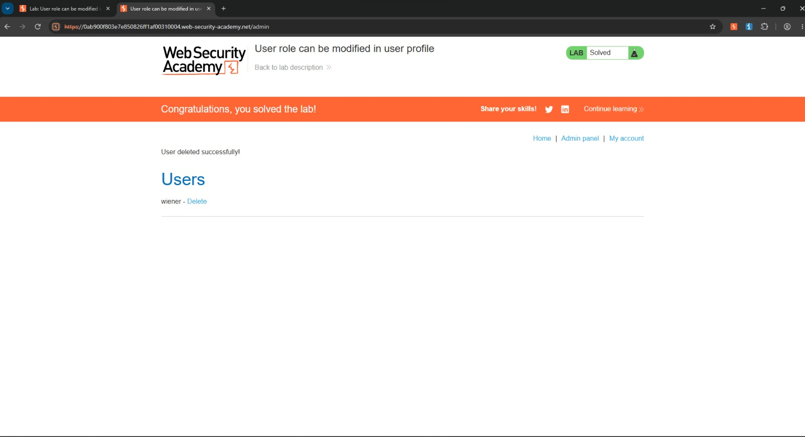

# User role can be modified in user profile

**Categoría:** Broken Access Control (OWASP A01)
**Tipo:** Escalada de privilegios vertical (Mass Assignment)
**Nivel:** Apprentice (principiante)
**Plataforma:** PortSwigger Web Security Academy

## Descripción

La funcionalidad de actualizar el email procesa el cuerpo de la petición (JSON) y asigna sus campos directamente a los datos del usuario, sin restringir cuáles puede modificar. Esto permite agregar un campo `roleid` y escalar a administrador.

## Pasos para reproducir

1. Iniciar sesión con las credenciales provistas por el lab (`wiener:peter`).
2. Interceptar con Burp Suite la petición `POST /my-account/change-email` que se genera al actualizar el email.
3. Observar que el cuerpo de la petición solo contiene el campo `email`:

       {"email":"test@test.com"}

4. Agregar el campo `roleid` con el valor correspondiente a administrador (2):

       {"email":"test@test.com","roleid":2}

5. Reenviar la petición (Forward).
6. Acceder a `/admin`: la aplicación concede acceso al panel, donde se puede eliminar al usuario carlos y completar el lab.

## Causa raíz

El servidor asigna de forma masiva (mass assignment) los campos recibidos del cliente a los datos del usuario, sin validar cuáles tiene permitido modificar. El campo `roleid`, que controla privilegios, no debería poder establecerse desde una petición del usuario.

## Remediación

Definir en el servidor una lista blanca de los campos que el usuario puede modificar (solo `email` en este caso) y descartar cualquier otro. El rol debe gestionarse exclusivamente del lado del servidor, nunca aceptándolo desde la petición del cliente.

## Impacto

Cualquier usuario autenticado puede escalar a administrador agregando un campo a una petición legítima, sin credenciales de admin. Esto le da acceso completo a las funciones administrativas de la aplicación.