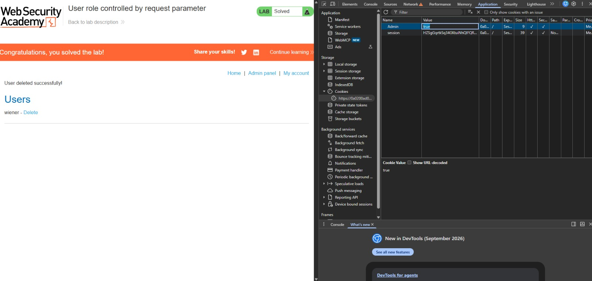

# User role controlled by request parameter

**Categoría:** Broken Access Control (OWASP A01)
**Tipo:** Escalada de privilegios vertical
**Nivel:** Apprentice (principiante)
**Plataforma:** PortSwigger Web Security Academy

## Descripción

La aplicación determina si un usuario es administrador leyendo una cookie (`Admin`) enviada por el navegador. Como esa cookie la controla el cliente, cualquier usuario puede modificarla para acceder al panel de administración.

## Pasos para reproducir

1. Iniciar sesión con las credenciales provistas por el lab (`wiener:peter`).
2. Intentar acceder a `/admin`. La aplicación responde: "Admin interface only available if logged in as an administrator".
3. Abrir las herramientas de desarrollador (F12) → Application → Cookies.
4. Observar una cookie `Admin` con valor `false`.
5. Cambiar el valor de la cookie a `true`.
6. Volver a acceder a `/admin`: la aplicación ahora concede acceso al panel, donde se puede eliminar al usuario carlos y completar el lab.

## Causa raíz

La aplicación decide el rol del usuario a partir de una cookie que viaja desde el cliente y que este puede modificar. En otras palabras, delega en el cliente una decisión de autorización que solo debería tomar el servidor.

## Remediación

El rol nunca debe determinarse por un valor controlable por el cliente (cookies, parámetros, campos ocultos). El servidor debe derivar el rol de su propia fuente confiable: la sesión autenticada y los datos del usuario almacenados en el servidor. Los controles de autorización deben basarse siempre en datos del lado del servidor.

## Impacto

Cualquier usuario autenticado puede escalar a administrador con solo modificar una cookie, sin necesidad de credenciales de admin. Esto le da acceso a funciones administrativas (como eliminar usuarios) y compromete por completo el control de acceso de la aplicación.